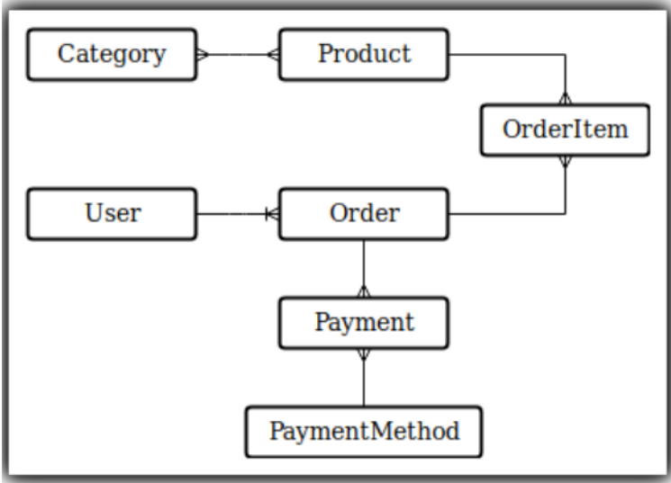

# README

# Desafío - Sistema e-Commerce (www.desafiolatam.com)

## Descripción
Tenemos un sistema de e-commerce donde el diagrama de modelos se representa en la
siguiente imagen:



Uno de nuestros clientes nos ha solicitado una serie de mejoras, ya que nuestro actual sistema no se ajusta a sus necesidades.
Nos pide que extendamos algunas funcionalidades de tal manera que los productos puedan tener muchas variaciones, por ejemplo, una polera puede tener talla X, M y L a la vez que cada una de ellas puede tener diferentes colores. El cliente es claro en indicarnos que cada una de estas variaciones maneja un stock independiente al resto.

Otro de los problemas que presenta, es que sus productos no pueden clasificarse sólo con
un nivel de categorías, ya que la categoría "Electrodomésticos" puede tener otras contenidas
como línea blanca o refrigeradores. El cliente nos indica que no hay límite de cuántas
categorías anidadas pueden haber, sólo nos asegura que una categoría sólo pertenece a
una, osea no puede haber una categoría con dos padres.
Finalmente, nos indica que deben haber dos funcionalidades específicas: en el catálogo sólo
se muestra un producto de cada tipo, esto es, si existe un modelo de zapatilla roja y otra
negra, en el catálogo debe aparecer sólo una de ellas, esto implica que debe haber una
página de descripción del producto en donde ahí podamos ver y elegir los colores y la talla,
si una variación no tiene stock, no se puede comprar. Esto es importante, ya que si todas las
variaciones no tienen stock, no debe aparecer en el catálogo principal.
Por problemas de implementación, el modelo OrderItem no podemos modificarlo y tendrá
que guardar los mismos datos: order_id, product_id, quantity y price.
Por fortuna, el cliente ha encargado el desarrollo del front-end a otra empresa, por lo que
solo debemos asegurar calidad en la estructuración de los datos.

## Instrucciones
Tip: Te recomendamos partir con la base del ejercicio realizado durante la lectura, en
material de estudio

1. Hacer un diagrama de modelos para cubrir las necesidades del cliente.
2. Crear la o las relaciones y modelos para manejar los productos y sus variaciones.
   Tip: utilizar scaffold e identificar los modelos que lo requieren.
3. Crear la o las relaciones y modelos para manejar las tallas y colores de las
   variaciones.
4. Implementar la solución para manejar distintos niveles de categorías y asegurarse
   que no tenga dos padres. También deberás implementar un test unitario para
   verificar este comportamiento
5. Generar un método o scope en las categorías, de tal forma que entregue una lista de
   cada categoría padre y otro de sus hijos, y los hijos de sus hijos, en todos los niveles.
6. Según su diseño, explicar al cliente cómo implementar la lista de productos del
   catálogo. (de un ejemplo en código). Si un modelo necesita código, debes entregarlo
   al cliente como parte de la implementación.
   Tip: se sugiere al momento de iniciar el proyecto en github, utilizar README.md para
   agregar las explicaciones que se solicitan.
7. Implementar o explicar las modificaciones (si las hay) al modelo OrderItem para que
   siga funcionando sin que afecte el resto del sistema.
   Tip: el modelo OrderItem tiene atributos ya establecidos, en caso de que la lógica de
   negocio requiera ingresar algún atributo extra, explicar el ¿por qué? en el archivo
   README.md

8. Nuestro cliente, a último minuto nos solicita que nuestro sistema soporte cupones
   de dos tipos:
   a) Uno para distribuir en redes sociales (1 cupón lo pueden ocupar muchas
   personas).
   b) Otro para clientes específicos (1 cupón solo lo puede ocupar un cliente
   específico).
   Los cupones pueden descontar un porcentaje de la compra o un monto específico.
   En el caso de un monto específico, si el cupón es mayor que la compra, el cupón no
   puede usarse en otra. Por temas de tiempo, sólo podrás entregarle una prueba de
   conceptos en la que debes incluir el modelado de los datos extendiendo el resultado
   de la pregunta 1 y además algunas implementaciones de código con los conceptos
   más importantes.
   Tip: Te recomendamos primero tomar o el a) o el b), y ya teniendo esto listo, empezar
   con el otro
   
   ___

## Consideraciones Iniciales

Para probar las funcionalidades rápidamente, hay dos usuarios creados por defecto:

User: test@mail.com
password: 123456

Admin: admin@mail.com
password: 123456

Así como hay productos, categorías, colores, tallas y variaciones creadas por defecto. Para modificar / eliminar o crear nuevos datos, esto debe realizarse en el archivo correspondiente en la ubicación 

#### db/seeds

## Ejemplos:

### Nueva Categoría

#### Categorías Padres
```ruby
categories = ['Shorts', 'Pants', 'Shirts', 'Dresses']
```
#### Subcategorías

```ruby
cat_id_01 = Category.find_by(name: "Shorts").id

subcategories = ['Men Shorts', 'Women Shorts', "Summer"]
subcategories.each do |subcat|
  Category.create(
    name: subcat,
    category_id: cat_id_01,
  )
end

```
### Nuevos Productos

1. Se asignan Categorías.
```ruby
category_shorts= Category.find_by(name: "Shorts")
category_shorts_men= Category.find_by(name: "Men Shorts")
```

2. Se crea el producto. El stock inicial es irrelevante, ya que este será reemplazado por la suma del stock de las variaciones creadas posteriormente. En este ejemplo el sku se asigna al azar, este puede ser modificado manualmente.

```ruby
p_01 = Product.create(
  name: "Denim shorts", 
  description: "Beautiful shorts for men", 
  stock: 0, 
  price: 21990, 
  sku: ('A'..'Z').to_a.shuffle.first(10).join
)
```
3. Se asignan los productos a las categorías correspondientes.

```ruby
p_01.categories << category_shorts
p_01.categories << category_shorts_men
```

### Nuevas Variaciones

1. Se extraen en variables los datos de Producto, Color y Talla (Size).

``` ruby
product_id_01= Product.find_by(name: "Denim shorts").id
product_id_02= Product.find_by(name: "Maui & Sons long sleeve Shirt").id
product_id_03= Product.find_by(name: "Zara ripped jeans").id

color_id_red = Color.find_by(description: "Red").id
color_id_black = Color.find_by(description: "Black").id
color_id_white = Color.find_by(description: "White").id
color_id_green = Color.find_by(description: "Green").id
color_id_yellow = Color.find_by(description: "Yellow").id

size_id_s = Size.find_by(description: "S").id
size_id_m = Size.find_by(description: "M").id
size_id_l = Size.find_by(description: "L").id
size_id_xl = Size.find_by(description: "XL").id
size_id_xxl = Size.find_by(description: "XXL").id
```
2. Se crean las variaciones necesarias:

``` ruby
Variation.create(
  product_id: product_id_01,
  color_id: color_id_black,
  size_id: size_id_m,
  stock: 10,
)
```

## Cupones

El modelo Coupon tiene los siguientes atributos:

| Atributos     | Valor         | Significado  |
| :-----------: |:-------------:| :-----:|
| unique        | false         | Cupón puede ser utilizado por muchos usuarios |
|               | true     |   Cupón corresponde sólo a un usuario |
| code | texto      |    Ejemplo: "VERANO2022".  |
| fix_discount | false      |    El descuento será un porcentaje del total de la compra  |
|  | true      |    El descuento será un monto fijo  |
| discount_value | decimal      | Ejemplos:   0.1: Si el descuento es porcentual, corresponde a un 10%.
5000 Descuento fijo de $5000|
| user_id | id del usuario, opcional     |    Este valor es nulo por defecto. En caso de asignarse, sólo el usuario correspondiente podrá utilizar el cupon, una sola vez  |
| used | default: false      |    Este valor es verdadero una vez el cupón es utilizado, lo que lo inhabilita de futuros usos  |

Actualmente está implementada la función para añadir un cupón por usuario.

## Creación de Cupones

En el archivo db/seeds/coupons.rb

### Ejemplos

``` ruby
# Social media coupon, 10% discount.
Coupon.create(
  unique: false,
  code: "SUMMER2022",
  fix_discount: false,
  discount_value: 0.1,
  used: false,
)

# Coupon for user_id 1, for $5000
Coupon.create(
  unique: true,
  code: "MYCOUPON",
  fix_discount: true,
  discount_value: 5000,
  user_id: 1,
  used: false,
)
```

## Modificaciones realizadas a la base de datos.

Es posible visualizar los modelos en los archivos Model - First Version.pdf y Final model.pdf.

Fue necesario modificar el modelo OrderItem para añadir el atributo variation_id; considerando que es necesario llevar registro de la variación que selecciona cada usuario al momento de hacer la compra, debido a que cada variación tiene un stock particular.
___

##### Desafío del programa Full-Stack de Desafío Latam. Realizado por María Paz Carvacho.
